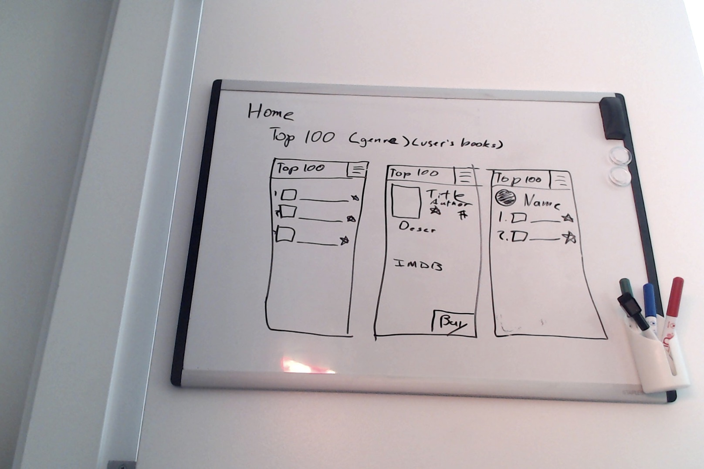
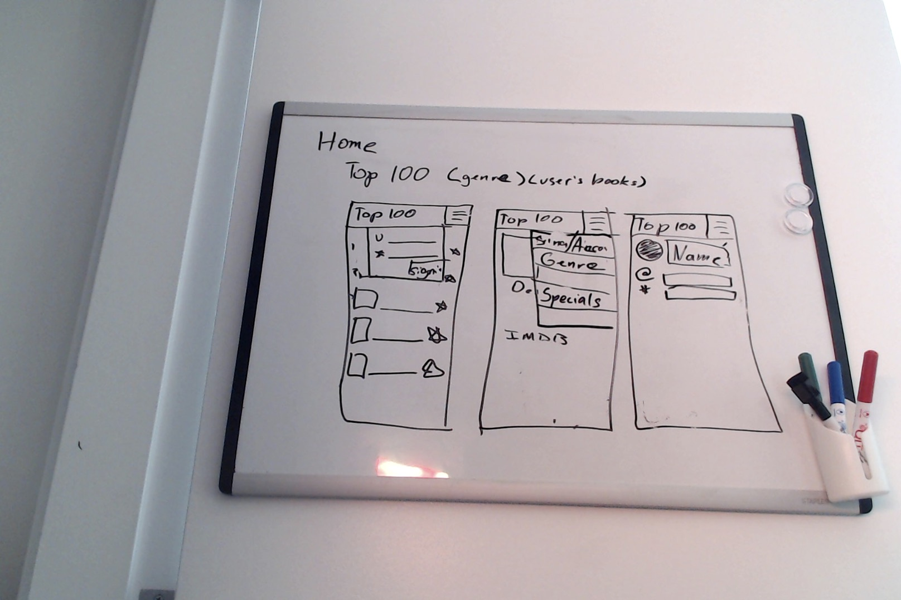
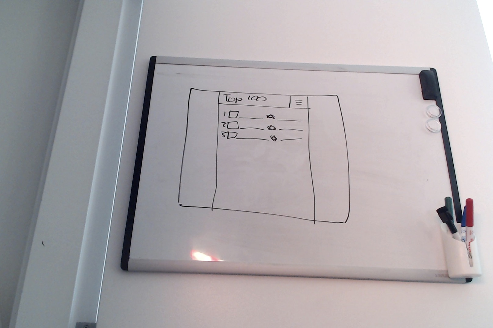

# Project One
Seanny and Mert's Project One for GA SEI-09

### Scope
Our site will allow users to rate books. These ratings will be aggragated and turned into a list of highest-rated books. They can also view lists of books by genre. A stretch goal would be to

#### External APIs
* [Google Books](https://developers.google.com/books)

#### Modules
* [Passport](http://www.passportjs.org/)
* [Express.js](https://expressjs.com/)
* [Mongoose](https://mongoosejs.com/)
* [body-parser](https://www.npmjs.com/package/body-parser)

### User Stories

1. **Authorized User**
  * User can make an account.
  * User can rate book.  (Create)
  * User can view ratings list. (Read)
  * User can view one rating. (Read)
  * User can add comments to rating. (Update)
  * User can remove rating. (Delete)
  * Stretch: User can create personal lists.
  * Stretch: User can add a book.

2. **Non-Authorized User**
  * User can see the rating list from others user ratings
  * User can filter lists by genre.
  * User can view details about specific books.
  * Stretch: User can see top-rated books for a particular week/month.

### Wireframes
**Mobile Device** 
 
 
**Larger Browsers** 
 

### Data Models and ERD
1. User
  * Email
  * Password
  * Screen Name
  * Rated Books = Array - Referenced
  * Stretch: Create Lists
2. Book
  * Title
  * Author
  * ISBN
  * Genre
  * Ratings = Array
 3. Rating
  * Rate
  * Comments
  * User
  * Book
  * Timestamp

### Feasibility Check

### Sprint Plan
#### Monday
  * Create Planning Doc

#### Tuesday
  * Get Approval
  * Begin Model/Schema design
  * Begin Front-end design
  * Set up API endpoints

#### Wednesday

#### Thursday
  * Learn authentication
  * Begin implementing authentication
#### Friday

#### Weekend

#### Monday
  * Present project together
